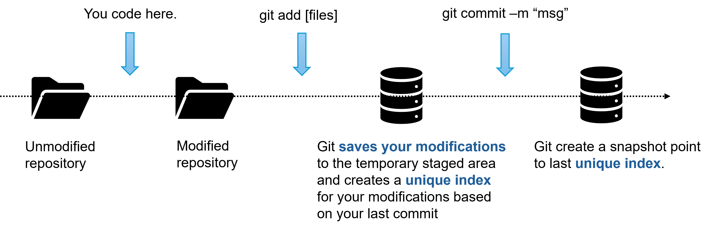

## Bash revision

|  Command  |                     Usage                     |
| :-------: | :-------------------------------------------: |
|  **ls**   |          **List directory contents**          |
| **echo**  |    **Prints text to the terminal window**     |
| **touch** |      **Creates a file (Not directory)**       |
| **mkdir** |            **Create a directory**             |
| **grep**  |                  **search**                   |
|  **man**  |  **Print manual or get help for a command**   |
|  **pwd**  |          **Print working directory**          |
|  **cd**   |             **Change directory**              |
|  **mv**   |         **Move or rename directory**          |
| **rmdir** |             **Remove directory**              |
| **less**  |   **view the contents of a file, even jpg**   |
| **more**  | **view the contents of a text file by pages** |


## Git

### The most widely used modern version control system.


### Solutions




### Let's go git !

#### Step 1. Init your project by git

```bash
# You want to initilize a totally new project named 'pythonb'
git init pythonb
# If you already have a project.
cd [your poject name]
git init .
```

#### Step 2. Let git know your modifications

```bash
# Add all files
git add .
# Add specific files
git add [filename1] [filename2]
```

#### Step 3. Check what we add

```bash
git status
```

#### Step 4. Commit your changes

```bash
git commit -m "commit message"
```

#### Step 4. See our commit log

```bash
git log
```


### Branch mechanism


#### Check branches

```bash
git branch -a
```

#### Change current branch name

```bash
git branch -M main
```

#### Create a new branch and switch to it

```bash
git checkout -b newbranch

#just switch to it
git checkout newbranch
```


### What is github?

GitHub is a cloud-based platform where you can store, share, and work together with others to write code.

Storing your code in a "repository" on GitHub allows you to:

- **Showcase or share** your work.
- **Track and manage** changes to your code over time.
- Let others **review** your code, and make suggestions to improve it.
- **Collaborate** on a shared project, without worrying that your changes will impact the work of your collaborators before you're ready to integrate them.

Collaborative working, one of GitHub’s fundamental features, is made possible by the open-source software, Git, upon which GitHub is built.


### Link your local git repository to remote repository

```bash
git remote add [name] [remote address]

#check remote
git remote -v

#push your commits to remote
git push [remote name] [remote branch]
```

